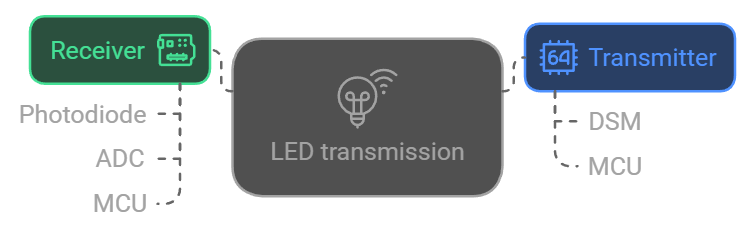

# LiFi Project

### What is LiFi?
>Li-Fi is a derivative of optical wireless communications (OWC) technology, which uses light from light-emitting diodes (LEDs) as a medium to deliver network, mobile, high-speed communication in a similar manner to Wi-Fi.

>Pure LiFi has a protocol which is complex and powerful, Although implementing it on a 8 Bit MCU seems slightly impossible. 

### Project info

This project demostrates how to send UART data over Light Emitting Diodes (LED) similar to LiFi. The Idealogy and process flow of the project is detailed in a [PPT here](https://github.com/Metabix/LiFi/blob/main/Project%20Presentation.pdf). 

This was more of a curiosity and fun project for me, I haven't expanded the application futher but LiFi is fascinating technology. I can see how it can be a possible replacement for faster network applications in the future. 

[Working Example Video](<LiFiworking.mp4>)

### Block Diagram

### Working Demo:
Check LiFiworking.mp4
<video controls src="LiFiworking.mp4" title="Title"></video>

#### Note :
- The project demonstrates one way transmission. 

### Future upgrades:
- Add two way communication
- Use Color Filters for immproving the range
- Transmit video

